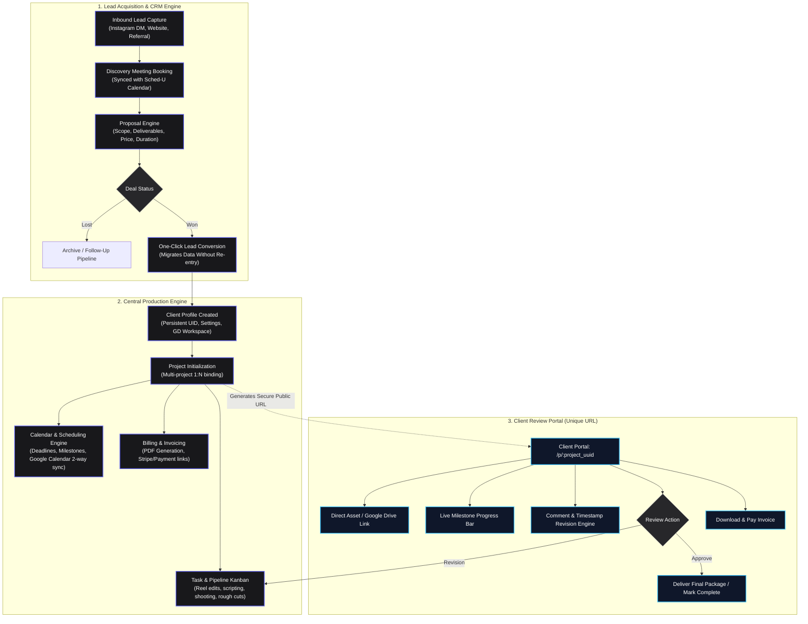

# Sched-U: Complete Application Workflow & Data Architecture Specification

## 1. System Overview & Architecture Topology

Sched-U is an end-to-end client, project, and scheduling operating system tailored for creative studios, freelance editors, and media production agencies. The application bridges the entire lifecycle from acquisition (Leads / Discovery) to operational delivery (Calendar, Tasks, Production Phases) and client collaboration (Dedicated Public Review Portals, Automated Invoicing, Google Drive syncing).

---

## 2. Granular Workflow Modules & Sub-Field Specifications

### Module 1: Lead Pipeline & CRM
Tracks potential clients from first contact through proposal closing. Prevents duplicate data entry upon conversion.

* **1.1 Lead Ingestion & Profile**
  * `lead_id` *(UUID, Primary Key)*
  * `source` *(Enum: Instagram DM, YouTube, Referral, Direct Form, Other)*
  * `client_name` *(String, Required)*
  * `handle_or_email` *(String, e.g., @instagram_handle or direct contact)*
  * `initial_inquiry` *(Text, e.g., "Needs 15 Reels per month")*
  * `estimated_budget` *(Decimal, Currency)*
  * `stage` *(Enum: New Lead, Meeting Scheduled, Proposal Sent, Negotiation, Won, Lost)*
  * `notes` *(Rich Text / Markdown)*

* **1.2 Discovery Meeting Scheduler**
  * `meeting_id` *(UUID)*
  * `lead_id` *(UUID, Foreign Key)*
  * `title` *(String, e.g., "15-Min Intro Call")*
  * `scheduled_start` *(Timestamp)*
  * `scheduled_end` *(Timestamp)*
  * `meeting_url` *(String, Google Meet / Zoom auto-generated link)*
  * `calendar_event_id` *(String, external Calendar sync ID)*
  * `outcome_notes` *(Text)*

* **1.3 Proposal & Scope Definition**
  * `proposal_id` *(UUID)*
  * `lead_id` *(UUID, Foreign Key)*
  * `client_ask` *(Text, summary of requirements)*
  * `deliverables_list` *(Array of Objects: `[{ title: "15 Short-form Reels", format: "9:16", turnaround: "48h" }]`)*
  * `contract_duration` *(String / Integer in days or months)*
  * `quoted_amount` *(Decimal)*
  * `valid_until` *(Date)*
  * `status` *(Enum: Draft, Sent, Accepted, Rejected)*

---

### Module 2: Client Profile Management
Persistent records representing paying clients. Clients can own multiple concurrent or recurring projects.

* **2.1 Client Master Entity**
  * `client_id` *(UUID, Unique, Primary Key)*
  * `display_name` *(String, e.g., "Atom / Atom Gaming")*
  * `primary_email` *(String, Unique)*
  * `billing_address` *(Object: Street, City, Country, Tax ID / GST / VAT)*
  * `contact_phone` *(String, Optional)*
  * `google_drive_folder_id` *(String, persistent client root Google Drive folder)*
  * `google_drive_folder_url` *(String, Direct web workspace link)*
  * `custom_notes` *(Text, persistent preferences, branding guides, fonts)*
  * `total_lifetime_value` *(Computed Decimal)*
  * `created_at` / `updated_at` *(Timestamps)*

---

### Module 3: Project Engine & Workspaces
The core hub coordinating tasks, billing, deadlines, and the external client-facing interface.

* **3.1 Project Entity**
  * `project_id` *(UUID, Primary Key)*
  * `client_id` *(UUID, Foreign Key $\rightarrow$ Clients)*
  * `project_name` *(String, e.g., "Batch Q4 Reels Edit")*
  * `description` *(Text / Markdown)*
  * `status` *(Enum: Backlog, In Progress, Review Pending, Revisions Requested, Approved, Completed, Archived)*
  * `total_amount_charged` *(Decimal)*
  * `currency` *(String, e.g., USD, EUR, INR)*
  * `google_drive_project_folder_url` *(String, specific workspace subfolder)*
  * `public_token` *(String, secure nano-ID / hash for external client viewing)*
  * `public_portal_url` *(Computed String: `https://app.sched-u.com/portal/:public_token`)*
  * `start_date` *(Date)*
  * `target_delivery_date` *(Date)*
  * `completion_date` *(Date, Nullable)*

* **3.2 Sub-Task & Production Phase Pipeline**
  Standardized milestone steps for creative workflows:
  * `phase_id` *(UUID)*
  * `project_id` *(UUID)*
  * `phase_name` *(Enum / String: Scripting, Footage / Dupe Ingestion, Rough Cut, Polish & VFX, Client Review, Final Revision)*
  * `order_index` *(Integer)*
  * `is_completed` *(Boolean)*
  * `completed_at` *(Timestamp)*

---

### Module 4: Task Engine & Production Hub
Individual tasks that operational team members and freelancers work on daily.

* **4.1 Task Entity**
  * `task_id` *(UUID, Primary Key)*
  * `project_id` *(UUID, Foreign Key $\rightarrow$ Projects)*
  * `task_name` *(String, e.g., "Reel Edit #04 - B-Roll Sync")*
  * `task_type` *(Enum: Reel Edit, Thumbnail, Script, Sound Design, Color Grading, Review)*
  * `priority` *(Enum: Low, Medium, High, Urgent / Critical)*
  * `status` *(Enum: Todo, In Progress, Ready For Internal QC, Ready For Client, Done)*
  * `assigned_to` *(UUID, Freelancer / Team Member ID)*
  * `deadline` *(Timestamp with Timezone)*
  * `estimated_hours` *(Float, e.g., 2.5 hours)*
  * `actual_hours_logged` *(Float)*
  * `deliverable_file_url` *(String, Direct preview link or GDrive asset)*
  * `comments` *(Array of threaded comment objects)*

---

### Module 5: Calendar & Scheduling Engine
Bi-directional scheduling integrating deadlines, shoots, discovery calls, and delivery dates.

* **5.1 Calendar Event Model**
  * `event_id` *(UUID, Primary Key)*
  * `entity_type` *(Enum: Lead Meeting, Project Milestone, Task Deadline, Client Delivery)*
  * `entity_id` *(UUID, Dynamic Reference to Lead, Project, or Task)*
  * `title` *(String)*
  * `start_time` *(Timestamp)*
  * `end_time` *(Timestamp)*
  * `all_day` *(Boolean)*
  * `external_sync_provider` *(Enum: Google Calendar, Outlook, Internal Only)*
  * `external_event_id` *(String)*
  * `color_code` *(Hex Color, categorical styling)*

---

### Module 6: Invoicing & Payment Automation
Automated billing tightly bound to project milestones.

* **6.1 Invoice Entity**
  * `invoice_id` *(UUID, Primary Key)*
  * `invoice_number` *(String, e.g., `INV-2026-0042`)*
  * `project_id` *(UUID, Foreign Key)*
  * `client_id` *(UUID, Foreign Key)*
  * `line_items` *(JSON Array: `[{ description: "15 Short-form Reels Edit", quantity: 1, rate: 1500, amount: 1500 }]`)*
  * `subtotal` *(Decimal)*
  * `tax_rate` *(Decimal)*
  * `tax_amount` *(Decimal)*
  * `total_due` *(Decimal)*
  * `status` *(Enum: Draft, Sent, Paid, Overdue, Cancelled)*
  * `due_date` *(Date)*
  * `pdf_download_url` *(String)*
  * `payment_link_url` *(String, Stripe Checkout / Bank transfer modal)*

---

### Module 7: Client Project Portal (External View)
Accessible by clients without logging into the internal agency dashboard. Accessed via unguessable URL (`/p/:public_token`).

* **7.1 Portal Features & Actions**
  1. **Google Drive Workspace Link**: Direct button to view raw and master assets.
  2. **Milestone Progress Tracker**: Live progress bar calculated from completed sub-tasks ($Prog = \frac{\text{Completed Phases}}{\text{Total Phases}} \times 100\%$).
  3. **Revision / Modification Box**:
     * Client selects version/video timestamp.
     * Inputs change requests with file upload attachments.
  4. **Approval Action Button**:
     * Changes project status to `Approved`.
     * Automatically triggers final invoice generation or completion notification.
  5. **Revision Request Action Button**:
     * Flips project status to `Revisions Requested`.
     * Automatically generates a prioritized revision task on the editor's Kanban board.
  6. **Invoice & Payment Action**:
     * "Check Invoice" button displays live invoice status, payment confirmation, or pay link.